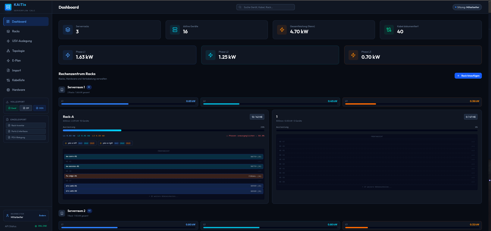
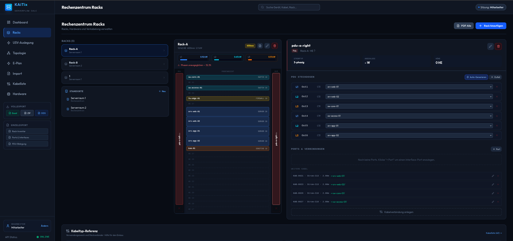
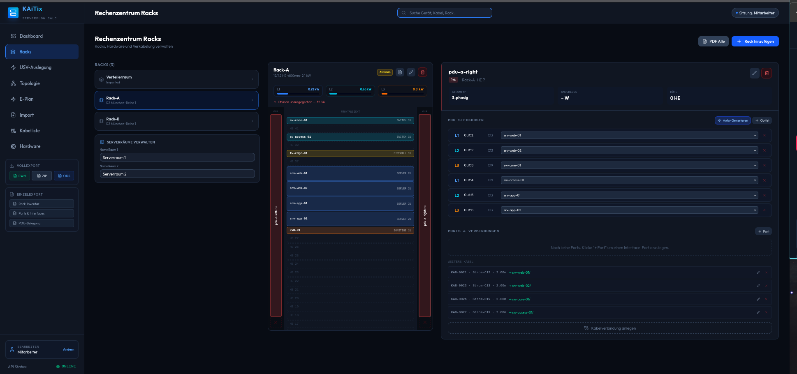
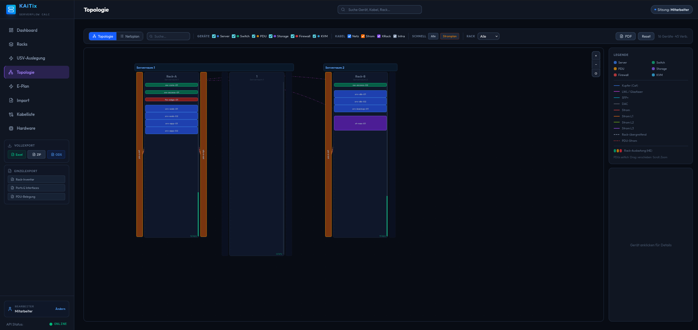
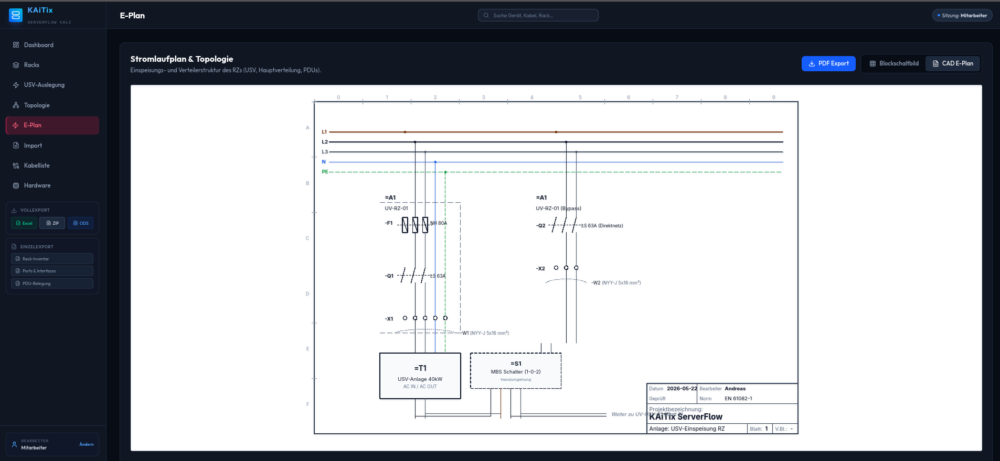

# KAiTix

**Predictive Analytics, Dokumentation & Runbook Orchestrator für IT-Infrastruktur**

[](https://www.gnu.org/licenses/agpl-3.0)
[](https://www.python.org/)
[](https://fastapi.tiangolo.com/)
[](https://svelte.dev/)

KAiTix dokumentiert physische RZ-Infrastruktur — Racks, Server, PDUs, Kabel, USV — und orchestriert Shutdown- und Startup-Sequenzen als Runbooks. Kein Monitoring, keine Live-Daten, keine Komplexität. Eintragen, planen, ausführen.

> **Typischer Workflow:** Techniker pflegt Infrastruktur ein → plant Wartungs-Shutdown als Runbook → führt Schritt für Schritt ab → Protokoll bleibt erhalten.

---

## Screenshots


*Dashboard — Übersicht aller Racks, Phasenauslastung und Schnellexport*


*Rechenzentrum Racks — Standorte, Rack-Belegung und PDU-Steckdosen*


*Rack-Detail — U-Position, Gerättypen, PDU-Verkabelung*


*Topologie — Netzwerk- und Stromverbindungen zwischen Racks, filterbar nach Kabeltyp*


*E-Plan — Allpoliger Stromlaufplan nach DIN EN 61082-1 mit PDF- und CAD-Export*

---

## Was KAiTix kann

### Rack-Dokumentation
Geräte (Server, Switches, Firewalls, PDUs, Storage) mit U-Position, Hersteller, Modell, Seriennummer und TDP erfassen. Kentix SmartPDU-Steckdosenbelegung pro Phase (L1/L2/L3) dokumentieren. Validierung ob PDU in Rack passt (min. Rack-Höhe).

### VM-Landschaft
Virtuelle Maschinen mit Host-Server-Zuordnung, Hypervisor-Typ und Abhängigkeitsgraph (`depends_on`). Visualisierung als interaktives Graphen-Diagramm — Hover zeigt Vorgänger und Nachfolger.

### Runbook Orchestrator
Shutdown- und Startup-Sequenzen als Runbooks planen und ausführen:
- **Drag & Drop Planer** — VMs und Geräte per Maus in Layer einteilen
- **Ausführungs-Protokoll** — Schritt für Schritt abhaken, wer hat wann abgehakt
- **Startup auto-generiert** — Umkehrung eines Shutdown-Runbooks auf Knopfdruck
- **Flexible Layer** — beliebig viele Ebenen, Reihenfolge frei wählbar

### Kabelmanagement & EPLAN-Import
Kabelliste mit Typ, Länge, Farbe und Quelle/Ziel. EPLAN CSV-Import mit Live-Vorschau. Export als XLSX, ODS oder CSV.

### Stromlaufplan & Topologie
Allpoliger Stromlaufplan (DIN EN 61082-1) als SVG. Topologie-Graph mit Geräten und Kabelverbindungen. **PDF-Export** direkt aus der Oberfläche.

### USV-Simulation
N+1 Redundanz-Kalkulation auf Basis dokumentierter Nennleistungen. Phasen-Imbalance-Anzeige (L1/L2/L3). MBS-Bypass-Simulation: welche Server werden bei Phasenausfall stromlos?

---

## Schnellstart (Docker — empfohlen)

Läuft auf **Windows, macOS und Linux** ohne weitere Abhängigkeiten.

```bash
git clone https://github.com/diebugger-tech/KAiTix.git
cd KAiTix
cp .env.example .env
docker compose up
```

Danach im Browser: **http://localhost**

### Voraussetzung: Docker Desktop

| Betriebssystem | Download |
|---|---|
| Windows 10/11 | [docker.com/products/docker-desktop](https://www.docker.com/products/docker-desktop/) |
| macOS | [docker.com/products/docker-desktop](https://www.docker.com/products/docker-desktop/) |
| Ubuntu / Debian | `sudo apt install docker.io docker-compose-plugin` |
| NixOS | Deklarativ via `virtualisation.docker.enable = true` |

---

## Kein Docker — Entwicklung lokal

### Linux & NixOS (mit Nix Shell)
```bash
# Nix-Shell aktiviert Python 3.12 + Node 22 automatisch via direnv:
cd KAiTix
direnv allow             # einmalig — danach automatisch beim cd

# Alternativ ohne direnv:
nix-shell

# Setup:
python3 -m venv .venv && source .venv/bin/activate
make install             # Python-Abhängigkeiten
make migrate-apply       # Datenbank einrichten
cd frontend && npm install && cd ..
make dev-all             # Backend :8003 + Frontend :5175
```

### Linux ohne Nix
```bash
python3 -m venv .venv && source .venv/bin/activate
make install && make migrate-apply
cd frontend && npm install && cd ..
make dev-all
```

### macOS
```bash
brew install python@3.12 node mysql pkg-config openssl
python3 -m venv .venv && source .venv/bin/activate
make install && make migrate-apply
cd frontend && npm install && cd ..
make dev-all
```

### Windows
Ohne Docker empfehlen wir **WSL2 + Ubuntu**, dann wie Linux oben.  
Alternativ: Docker Desktop (siehe Schnellstart).

---

## Demo-Daten laden

```bash
# Mit aktivem .venv und laufender Datenbank:
PYTHONPATH=. python3 scripts/seed_testdata.py
# → 2 Racks, 8 Geräte, 6 VMs, 2 Runbooks (Shutdown + Startup)
```

---

## Makefile-Referenz

| Befehl | Beschreibung |
|---|---|
| `make dev` | Backend starten (Port 8003) |
| `make dev-frontend` | Frontend starten (Port 5175) |
| `make dev-all` | Backend + Frontend parallel |
| `make install` | Python-Abhängigkeiten installieren |
| `make test` | pytest ausführen |
| `make lint` | ruff + mypy |
| `make format` | ruff fix + format |
| `make migrate-create message="..."` | Alembic-Migration erstellen |
| `make migrate-apply` | Migrationen anwenden |
| `make clean` | Temporäre Dateien löschen |

---

## Stack

- **Backend:** FastAPI 0.136+, SQLAlchemy 2.0 async, Alembic, MySQL 8, aiomysql
- **Frontend:** Svelte 5, Vite, Vanilla JS (kein TypeScript), Lucide Icons
- **Dev-Umgebung:** Nix Shell (`shell.nix`), direnv, Python venv
- **Export:** openpyxl (XLSX), odfpy (ODS), SVG → PDF via Browser-Print
- **Deployment:** Docker Compose + nginx reverse proxy

---

## Lizenz

[AGPL-3.0](LICENSE) — freie Nutzung im eigenen Unternehmen. Modifikationen die als SaaS betrieben werden müssen unter gleicher Lizenz veröffentlicht werden.
