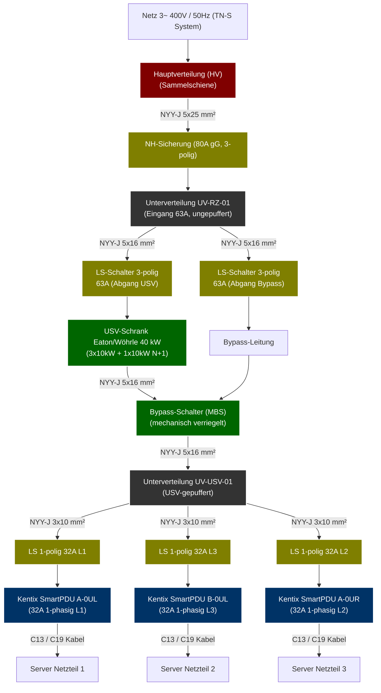

# KAiTix Stromlaufplan & Power-Topologie

Dieses Dokument beschreibt die physische Stromversorgungstopologie für das Rechenzentrum und die Anbindung der USV-Anlage (Unterbrechungsfreie Stromversorgung) gemäß DIN VDE-Richtlinien.

Die gesamte Netztopologie wurde über die E-Plan-Schnittstelle (`eplan_power_import.csv`) vollständig in KAiTix importiert und ist unter `/topology` grafisch als interaktiver Topologie-Graph aufrufbar.

---

## 1. Topologie-Diagramm (Mermaid)

---

## 2. Technische Spezifikation der Komponenten

### Hauptzuleitung & Schutzorgane
* **Einspeisung:** Netz 3~ 400V/50Hz (TN-S Netzform).
* **Hauptsicherung (HV):** NH-Sicherung 80A gG, 3-polig. Zuleitung zur `UV-RZ-01` erfolgt über ein halogenfreies Kabel **NYY-J 5x25 mm²**.
* **Unterverteilung UV-RZ-01:** Ungepufferte RZ-Unterverteilung mit einem Nennstrom von 63A.

### USV & Bypass-Zweige (Redundanz & MBS)
* **Zweig A (USV):** Absicherung mit einem 3-poligen Leitungsschutzschalter (LS) 63A. Zuleitung über **NYY-J 5x16 mm²** zum USV-Schrank.
  * **USV-Anlage:** Modulares Eaton/Wöhrle USV-System mit **40 kW** Gesamtleistung, konfiguriert als **3x10 kW active + 1x10 kW N+1 Redundanz**.
* **Zweig B (Bypass):** Absicherung mit einem 3-poligen LS-Schalter 63A. Zuleitung über **NYY-J 5x16 mm²** zur manuellen Service-Bypass-Einheit (MBS).
* **Bypass-Schalter (MBS):** Mechanisch verriegelter Umschalter, um die USV unterbrechungsfrei für Wartungsarbeiten zu umgehen.

### Gepufferte Unterverteilung & PDU-Zuleitungen
* **Unterverteilung UV-USV-01:** USV-gepufferter Verteiler, Zuleitung vom MBS-Ausgang über **NYY-J 5x16 mm²**.
* **Rack-PDUs:** Speisung der im Rack montierten SmartPDUs (je 32A, 1-phasig) zur optimalen Lastverteilung über die drei Phasen L1, L2 und L3:
  1. **Phase L1:** LS 1-polig 32A ──► **Kentix SmartPDU A-0UL** (Rack-A links)
  2. **Phase L2:** LS 1-polig 32A ──► **Kentix SmartPDU A-0UR** (Rack-A rechts)
  3. **Phase L3:** LS 1-polig 32A ──► **Kentix SmartPDU B-0UL** (Rack-B links)
  * Die Anbindung der PDUs erfolgt über hochflexible Leitungen des Typs **NYY-J 3x10 mm²**.

---

## 3. Datenbank-Import (E-Plan CSV-Schema)

Die folgenden Verbindungen wurden über das E-Plan CSV-Import-System in der KAiTix-Datenbank hinterlegt:

| Kabelnummer | Kabeltyp | Länge (m) | Farbe | Quelle (Gerät & Port) | Ziel (Gerät & Port) |
|---|---|---|---|---|---|
| `W-HV-UV-01` | Strom-CEE-63A-3P | 15.0 | Schwarz | `HV-RZ-01` (Abgang-UV-RZ-01) | `UV-RZ-01` (Einspeisung) |
| `W-UV-USV-01` | Strom-CEE-63A-3P | 8.0 | Schwarz | `UV-RZ-01` (Abgang-USV) | `USV-Schrank-40kW` (Einspeisung) |
| `W-UV-MBS-01` | Strom-CEE-63A-3P | 8.0 | Schwarz | `UV-RZ-01` (Abgang-Bypass) | `MBS-Bypass` (Einspeisung-Bypass) |
| `W-USV-UV-USV-01` | Strom-CEE-63A-3P | 3.0 | Schwarz | `USV-Schrank-40kW` (Ausgang) | `UV-USV-01` (Einspeisung-USV) |
| `W-MBS-UV-USV-01` | Strom-CEE-63A-3P | 3.0 | Rot | `MBS-Bypass` (Ausgang-Bypass) | `UV-USV-01` (Einspeisung-Bypass) |
| `W-UV-USV-PDU-A-0L` | Strom-CEE-32A-3P | 10.0 | Blau | `UV-USV-01` (Abgang-PDU-A-L) | `SmartPDU-A-0UL` (Einspeisung) |
| `W-UV-USV-PDU-A-0R` | Strom-CEE-32A-3P | 10.0 | Gelb | `UV-USV-01` (Abgang-PDU-A-R) | `SmartPDU-A-0UR` (Einspeisung) |
| `W-UV-USV-PDU-B-0L` | Strom-CEE-32A-3P | 12.0 | Violett | `UV-USV-01` (Abgang-PDU-B-L) | `SmartPDU-B-0UL` (Einspeisung) |
