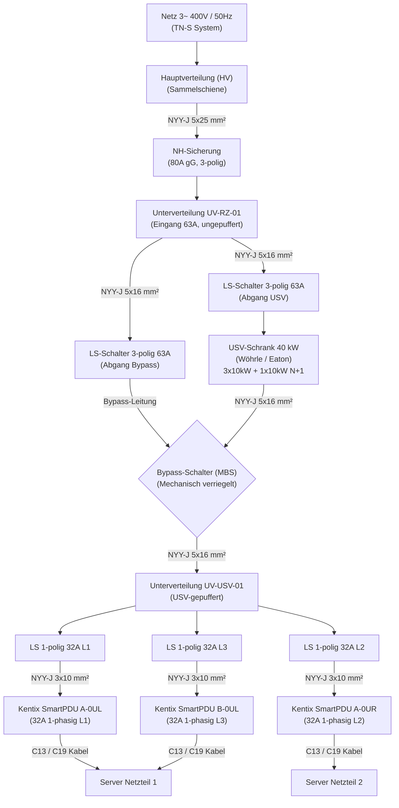

# USV-Stromlaufplan & Topologie (40kW System)

Dieses Dokument beschreibt die elektrotechnisch korrekte, VDE-konforme Hierarchie für die Integration eines 40kW USV-Schranks (z. B. Wöhrle WP2-R oder Eaton 93PM) in die Rechenzentrumsinfrastruktur sowie die Abbildung im KAiTix-Datenmodell via EPLAN-Import.

---

## 1. Korrekter Stromlaufplan (Mermaid)

Im korrekten Stromlaufplan wird die USV von der Haupt-Unterverteilung (`UV-RZ-01`) gespeist und versorgt nachfolgend eine separate, USV-gepufferte Unterverteilung (`UV-USV-01`), von der aus die Racks/PDUs angefahren werden. Ein manueller Bypass-Schalter (MBS) erlaubt das unterbrechungsfreie Umschalten auf Direktnetz für Wartungsarbeiten.

---

## 2. Kabeldimensionierung & Sicherungen (VDE-konform)

### Zuleitung Hauptverteilung ──► Unterverteilung `UV-RZ-01`
*   **Max. Last:** 40 kW USV + Hilfseinrichtungen (Lüfter, etc.) ≈ 58 A Nennstrom bei Vollast.
*   **Kabelquerschnitt:** **NYY-J 5×25 mm²**
    *   *Begründung:* Bei Verlegeart B2 (z. B. auf Kabelrinne oder im Installationskanal) beträgt die Strombelastbarkeit für 16 mm² nur ca. 57 A. Dies ist zu knapp. Ein **25 mm²** Kabel hat eine Belastbarkeit von ca. 73 A und bietet ausreichend Reserve.
*   **Absicherung:** **80 A gG (NH-Sicherung oder Leistungsschalter)** in der HV.

### Zuleitungen USV & Bypass-Schalter (MBS)
*   **Max. Strom:** 58 A (begrenzt durch Einspeisung und Überlastreserven).
*   **Kabelquerschnitt:** **NYY-J 5×16 mm²** (für USV-Eingang, USV-Ausgang und Bypass-Zuleitung zum MBS).
*   **Absicherung:** **LS-Schalter 3-polig 63 A (Charakteristik C oder gG-Sicherungen)** in `UV-RZ-01`.

### Zuleitung Unterverteilung `UV-USV-01` ──► SmartPDUs
*   **PDU-Nennstrom:** 32 A (1-phasig).
*   **Kabelquerschnitt:** **NYY-J 3×10 mm²** (oder 5×10 mm² bei 3-phasigen PDUs).
    *   *Begründung:* Gemäß Verlegeart B2 sind 6 mm² (bis 35 A) im Serverraum thermisch oft grenzwertig. Ein **10 mm²** Kabel (belastbar bis 46 A) stellt sicher, dass auch bei Dauerlast (32 A) kein nennenswerter Spannungsabfall entsteht.
*   **Absicherung:** **LS-Schalter 1-polig 32 A (Charakteristik C)** in `UV-USV-01`.

---

## 3. EPLAN-Import Datenstruktur

Über den EPLAN CSV Import (`import_eplan.py`) können diese physischen Power-Verbindungen importiert werden. Dadurch werden die Geräte (HV, UVs, USV, MBS, PDUs) und die entsprechenden Verbindungskabel automatisch im Modell angelegt.

Ein passendes CSV-Template wurde unter `/home/andreas/.gemini/antigravity/brain/1eece267-00ff-4887-982d-21bb8f58c729/scratch/eplan_power_import.csv` generiert.
